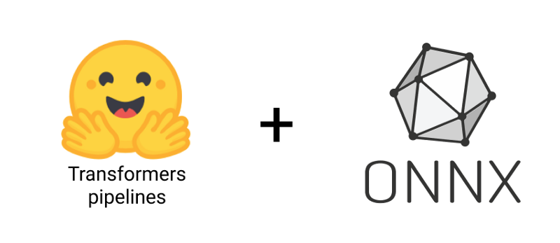

# Hugging Face 🤗 NLP Transformers pipelines with ONNX

ONNX is a machine learning format for neural networks. It is a portable, open-source and really awesome to boost
inference speed without sacrificing accuracy. 

I found a lot of tutorials and articles about ONNX benchmarks but none of them presented a convenient way to use it for 
real-world NLP tasks. I also answered a lot of questions about ONNX and the best way to use it for NLP on Hugging Face's
discord server.

This is why I decided to create this project to help you to achieve the best possible results with ONNX.

This project is linked to the following Medium blog post: 
[How to use Hugging Face 🤗 Transformers with ONNX in real world]() (🚧 incoming soon)

# How to use it

This repository contains a notebook to show how to export Hugging Face's NLP Transformers models to ONNX and how to use
the exported model with the appropriate Transformers pipeline.

This is the fastest way I found to use ONNX models with the awesome Transformers pipelines in production and without 
copying and pasting hundreds of lines of code.

The workflow is as follows:

- Export the model to ONNX.
- Create a new pipeline that inherits from the Transformers pipeline.
- Overcharge the pipeline's task class to use the exported model.
- Run the pipeline with ONNX.

All steps are explained in the notebook. Enjoy! 🤗

# Support

If you have any questions or face any issues, please open an issue on [GitHub](https://github.com/ChainYo/transformers-pipeline-onnx/issues).

I'm planning to add more examples and support for other NLP tasks. Let me know if you have any ideas!
